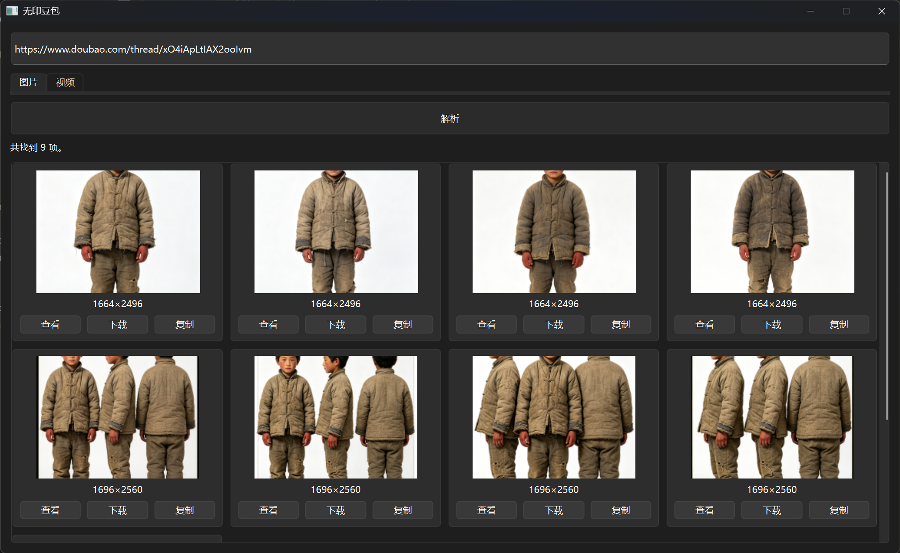
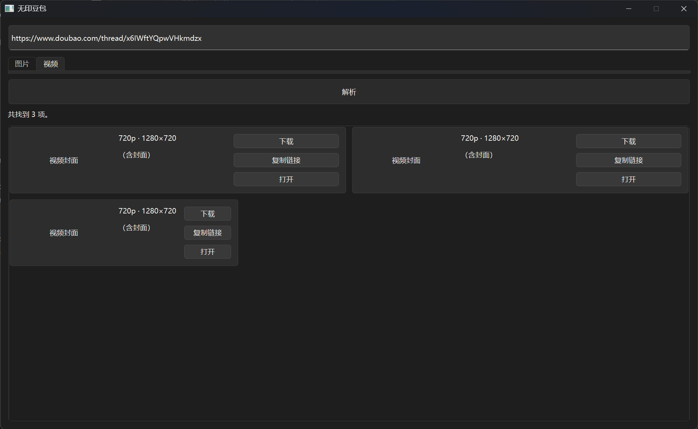

<div align="center">
  <h1>无印豆包 · 桌面客户端</h1>
</div>
<p align="center">
  <a href="LICENSE"></a>
  <a href="https://www.python.org/downloads/"></a>
</p>

<p align="center">基于 PySide6 的桌面客户端，从豆包（Doubao / Dola）对话链接中提取无水印图片和视频资源</p>

## 简介

本项目是 [无印豆包](https://github.com/ihmily/doubao-nomark) 的桌面客户端实现，参考其解析逻辑，
使用 Python + PySide6 构建原生 GUI。仅支持豆包系（`www.doubao.com`、`www.dola.com`），
未包含千问（Qianwen）解析。

## 功能

- 粘贴豆包对话分享链接，一键解析 **无水印图片** 和 **无水印视频**
- 图片：缩略图网格预览，支持查看 / 下载 / 复制链接
- 视频：卡片展示宽高、清晰度，支持下载 / 复制链接 / 打开
- 网络解析在后台线程执行，界面不卡顿

## 快速开始

### 环境要求

- Python 3.13+
- [uv](https://docs.astral.sh/uv/)（推荐）或 pip

### 使用 uv

```bash
# 1. 安装依赖并创建虚拟环境
uv sync

# 2. 运行客户端
uv run python main.py
```

### 使用 pip

```bash
# 1. 安装依赖
pip install PySide6 httpx cryptography pytest pytest-asyncio ruff

# 2. 运行客户端
python main.py
```

## 界面预览

| 图片下载 | 视频下载 |
| :---: | :---: |
|  |  |

## 使用说明

1. 在豆包 App / 网页端，长按对话中的图片或视频，点击「分享」并复制链接地址
   （形如 `https://www.doubao.com/thread/xxxxxx`）。
   > 视频分享链接获取方式与图片一致。
2. 将链接粘贴到客户端输入框。
3. 选择「图片解析」或「视频解析」标签页，点击「解析」。
4. 在结果中查看、下载或复制无水印资源链接。

## 项目结构

```
.
├── main.py          # 程序入口
├── parser/          # 豆包解析包（自包含，纯逻辑，仅 doubao）
│   ├── image.py         # 图片解析
│   ├── video.py         # 视频解析
│   └── video_crypto.py  # qAAB / AES 解密
├── app/             # PySide6 界面
│   ├── main_window.py   # 主窗口
│   ├── worker.py        # 后台解析/下载线程
│   └── widgets.py       # 图片/视频卡片组件
└── tests/           # pytest 测试
```

## 开发

```bash
# 运行测试
uv run pytest

# 代码检查
uv run ruff check .

# 代码格式化
uv run ruff format .
```

## 许可证

本项目仅供学习交流使用，采用 [MIT](LICENSE) 许可证。

**注意**：使用本服务时请遵守豆包平台的使用条款和相关法律法规。

## 支持

如果你觉得这个小应用有用，欢迎请我喝杯咖啡 ☕

<div align="center">
  
</div>
